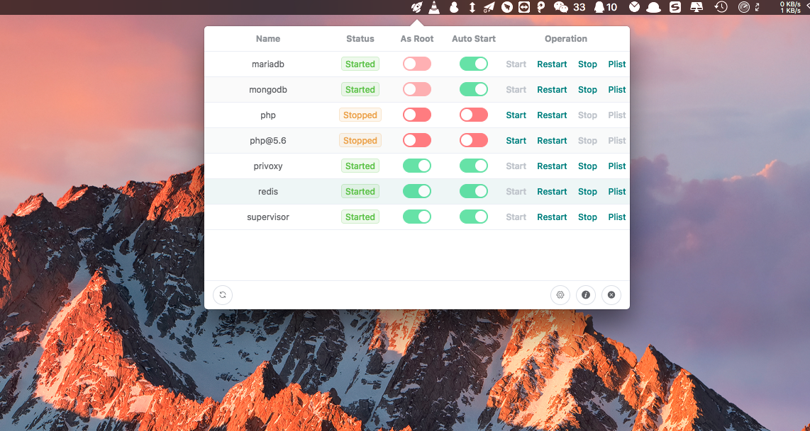

# BrewServicePanel

> 一个用于管理homebrew服务的控制面板

[[中文文档](README_CN.md)] [[English README](README.md)]

#### 预览


#### 发行版本
从 [releases](https://github.com/xiaozhuai/brew_service_panel/releases) 页面下载。

#### 构建步骤
``` bash
# 安装依赖
yarn

# 以开发环境运行
yarn run dev

# 构建用于生产环境的发行版本
yarn run build
```

#### 实现
此项目构建于 [electron-vue](https://github.com/SimulatedGREG/electron-vue) 之上.

并依赖于下面的软件包：
- [electron](https://github.com/electron/electron) Build cross-platform desktop apps with JavaScript, HTML, and CSS
- [vue](https://github.com/vuejs/vue) A progressive, incrementally-adoptable JavaScript framework for building UI on the web.
- [electron-vue](https://github.com/SimulatedGREG/electron-vue) An Electron & Vue.js quick start boilerplate with vue-cli scaffolding, common Vue plugins, electron-packager/electron-builder, unit/e2e testing, vue-devtools, and webpack.
- [request](https://github.com/request/request) Simplified HTTP request client.
- [sudo-prompt](https://github.com/jorangreef/sudo-prompt) Run a command using sudo, prompting the user with an OS dialog if necessary.
- [compare-versions](https://github.com/omichelsen/compare-versions) Compare semver version strings to find which is greater, equal or lesser.
- [auto-launch](https://github.com/Teamwork/node-auto-launch) Launch applications or executables at login (Mac, Windows, and Linux)

#### 支持
如果此工具对你有用，请不要吝啬你的 **star** ❤️

#### 贡献
如果你想贡献此项目，欢迎提交pr或开启issue。

#### 许可证
此项目基于 [MIT](LICENSE) 许可证发行。
